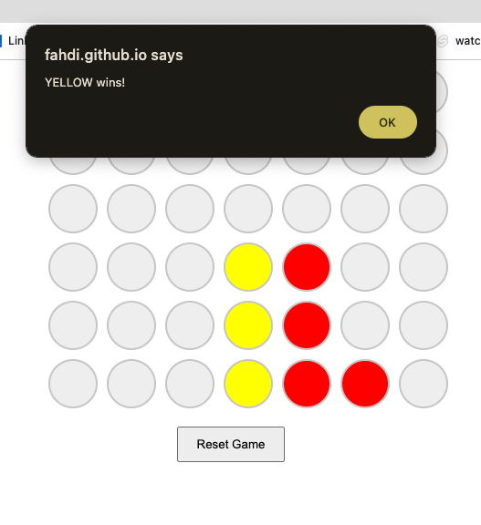

# Connect Four

Connect Four is a classic two-player connection game in which players take turns dropping coloured discs into a grid. The objective of the game is to be the first to form a horizontal, vertical, or diagonal line of four of one's own discs.



## Table of Contents

- [Connect Four](#connect-four)
  - [Table of Contents](#table-of-contents)
  - [Introduction](#introduction)
  - [Features](#features)
  - [Demo](#demo)
  - [Getting Started](#getting-started)
    - [Prerequisites](#prerequisites)
    - [Installation](#installation)
  - [Usage](#usage)
  - [Contributing](#contributing)
  - [License](#license)
  - [Acknowledgments](#acknowledgments)

## Introduction

Connect Four is a classic strategy board game that is easy to learn but offers deep and engaging gameplay. This project provides a web-based implementation of Connect Four for you to play and enjoy.

## Features

- Play Connect Four against another player on the same device.
- A user-friendly and responsive game board.
- Win-checking logic for horizontal, vertical, and diagonal wins.
- Reset the game at any time to start a new round.

## Demo

You can play a live demo of Connect Four [here](https://fahdi.github.io/connect-four/).

## Getting Started

Follow these instructions to get a copy of the project up and running on your local machine for development and testing purposes.

### Prerequisites

You will need a modern web browser to run this project.

### Installation

1. Clone the repository to your local machine:

   ```bash
   git clone https://github.com/fahdi/connect-four.git
   ```

2. Open the `index.html` file in your preferred web browser.

## Usage

- To start a new game, click the "Reset Game" button.
- Players take turns clicking on the columns to drop their discs.
- The first player to connect four discs in a row (horizontally, vertically, or diagonally) wins.

## Contributing

Contributions are welcome! If you'd like to contribute to this project, please follow the typical GitHub fork and pull request workflow.

## License

This project is licensed under the [MIT License](LICENSE).

## Acknowledgments

- [Fahad Murtaza](https://github.com/fahdi) - Project Author
